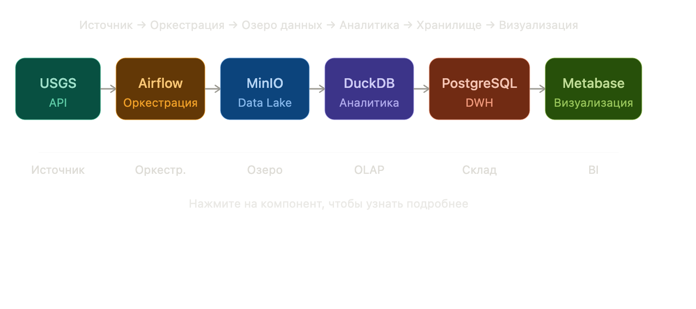
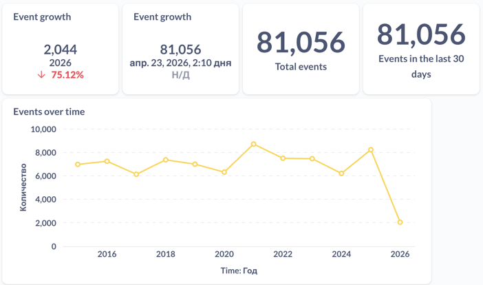

# Earthquake Data Pipeline

## Архитектура


## Технологии
- Apache Airflow — оркестрация
- MinIO — S3-совместимое хранилище
- DuckDB — быстрая трансформация
- PostgreSQL — хранилище данных
- Metabase — визуализация

## Как запустить
```bash
docker-compose up -d
airflow variables set access_key minioadmin
airflow variables set secret_key minioadmin
airflow connections add postgres_dwh --conn-type postgres --conn-host postgres_dwh --conn-login postgres --conn-password postgres


## Что я сделал
Историческая загрузка данных о землетрясениях (2015-2025, 80k+ записей)
Инкрементальная ежедневная загрузка
Идемпотентные DAG (можно перезапускать без дублей)
Проверки качества данных
Визуализация в Metabase

## Результаты
Самое сильное землетрясение за 10 лет: магнитуда 7.5
В среднем ~7000 землетрясений в год с магнитудой > 4.5